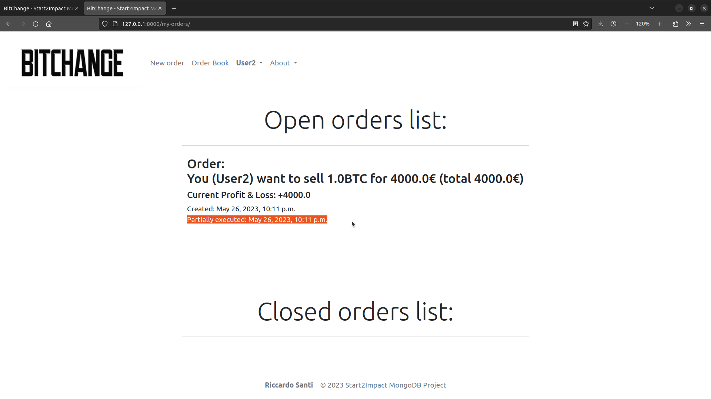

# Start2Impact MongoDB Project

    

This is my MongoDB project for [Start2Impact](https://talent.start2impact.it/profile/riccardo-santi).

### The main purpose of this project is to build a Bitcoin exchange platform using Django, Djongo and MongoDB.

BitChange allows users to register and log into the platform and gives from 1 to 10 bitcoins and 20'000€ to every new user to start trading.
Customers can post buy or sell orders for a certain amount of Bitcoin at a specific price in €.
The platform matches user orders based on the quantity of Bitcoin and the Euro price, and doesn't charge any fees.

__Django__ is a powerful and popular Python based web framework for building web applications.
 
__MongoDB__ is a high-performance NoSQL database that provides flexible and scalable data storage capabilities.
 
__Djongo__ is a database connector that allows Django to interact with MongoDB.

## 📖Index

- [ 🚀 Main Features ](#mainfeatures)
- [ 🛠️ How to deploy ](#howtodeploy)
- [ 📈 Improved Skills ](#improvedskills)
- [ 👨‍💻 About me ](#aboutme)

## 🚀 Main Features: 

- #### A page where users can create a new account and then log into the platform

    
    
    

  

- #### A dashboard page where users can see their current wallet balance and their total profit & loss

    
    

  

- #### A page where anyone can see the list of open orders not yet matched 

    

  

- #### A page where users can post new orders

    <h5 align="left">Example of User1 creating a buy order</h5>
    
    
    
      
    <h5 align="left">Example of User2 creating a sell order</h5>
    

  

- #### A page where users can see their orders status

    <h5 align="left">Example of User1 buy order full match with User2 sell order</h5>
    
    
    <h5 align="left">Example of User2 sell order partial match with User1 buy order</h5>
    
    

  

- #### A page where users can get a Json report of their orders

    

  

- #### A page where users can delete one of their open orders

    
    
    

  

- #### The ability to adapt the website page and content to different types of devices to allow users to have always the best experience

    
    

  

## 🛠️ How to deploy

- Clone this repository in your local
- Be sure to have Python installed on your device, for this project i used Python 3.10.6.
- Be sure to have a Python IDE on board (I recommend [PyCharm](https://www.jetbrains.com/pycharm/))
- Open the program main directory in your IDE, open a new terminal window and type `pip install virtualenv`
- Create a virtual environment by typing `python3.10  -m venv env` and activate it with `source env/bin/activate`
- Install program requirements by typing `pip install -r requirements.txt`
- Update the program MongoDB database by typing `cd Project`, `python manage.py makemigrations` and `python manage.py migrate`
- Run the program by typing `python manage.py runserver`
- Open [http://127.0.0.1:8000/](http://127.0.0.1:8000/) in your browser and enjoy BitChange!

## 📈 Improved Skills
[Python](https://www.python.org/), [Django](https://www.djangoproject.com/), [Djongo](https://github.com/doableware/djongo#readme), [MongoDB](https://www.mongodb.com/), HTML & CSS with [Bootstrap](https://getbootstrap.com/)

## 👨‍💻 About me

